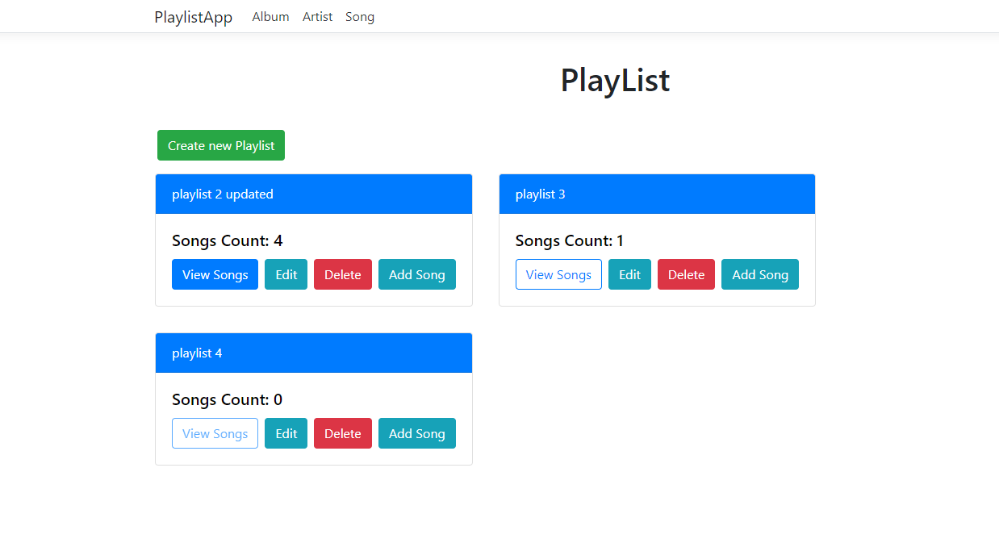
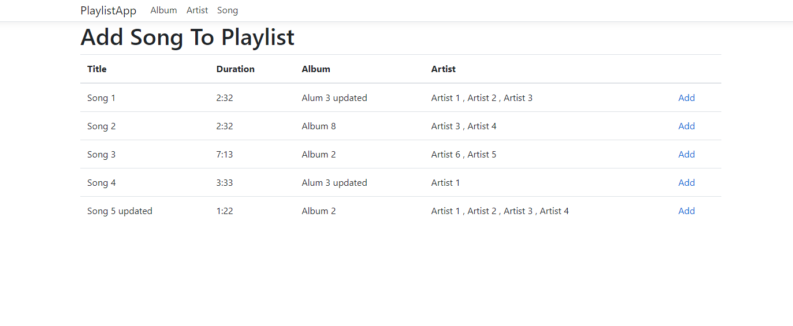
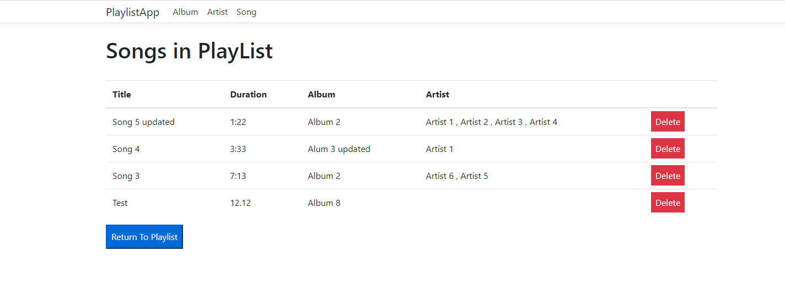
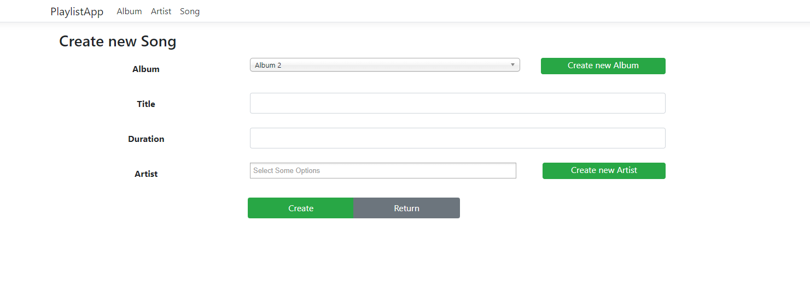
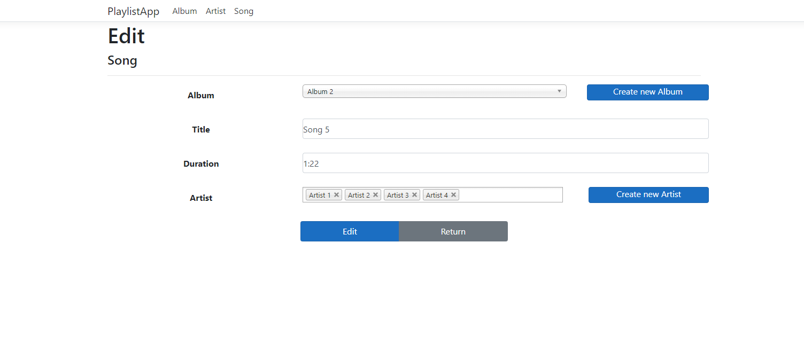

## Introduction
A Music PlayList App system built in .NET 5.0 with Entity Framework Core. Enables the user to manage their music playist,song,album,artist with basic CRUD operations. 

## Used technologies
- ASP.NET 5.0 MVC with Entity Framwork Core
- Standard Razor views with Bootstrap 5
- MS SQL 

## Documentation
### Playlist
- View
</img>

- Add Song

</img>

- View Song

</img>

### Album
- View
</img>

### Song
- Create
</img>

- Edit
</img>

